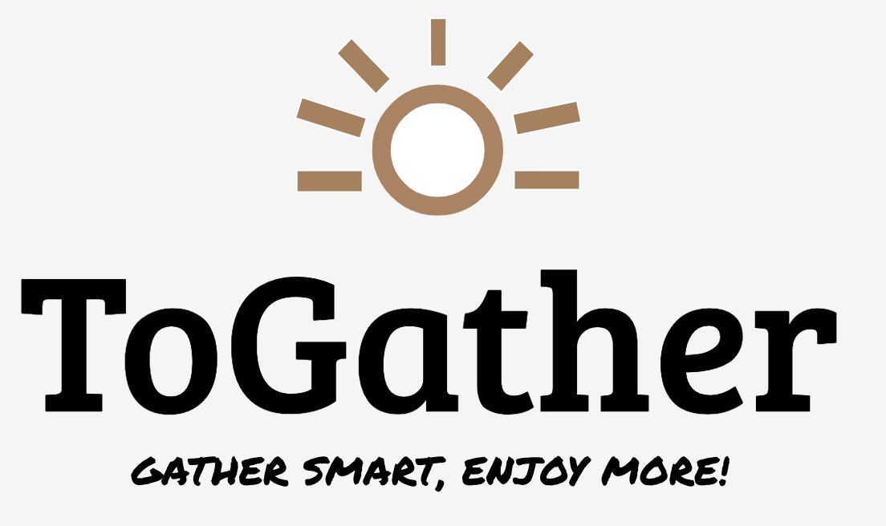

# 開発アプリ 「ToGather」


- [発表資料](https://www.canva.com/design/DAF6evopcIo/UdRYYtwNRO8SzdgSl_snfg/edit?utm_content=DAF6evopcIo&utm_campaign=designshare&utm_medium=link2&utm_source=sharebutton)
- [X](https://twitter.com/geek_pjt/status/1749003473793028118?ref_src=twsrc%5Etfw%7Ctwcamp%5Etweetembed%7Ctwterm%5E1749003473793028118%7Ctwgr%5Edda1fefe313cc4c52629fdc55e6bdd48fd263fad%7Ctwcon%5Es1_c10&ref_url=https%3A%2F%2Fpublish.twitter.com%2F%3Furl%3Dhttps%3A%2F%2Ftwitter.com%2Fgeek_pjt%2Fstatus%2F1749003473793028118)
- [アプリURL](https://geek-hackathon-psi.vercel.app/)

## git 関連

### 自分の作業ブランチの変更をリモートに push する時

```
git add .
git commit -m "<変更内容>"
git push -u origin
```

### 最新の main ブランチを自分の作業ブランチに取り込む時

自分が作業している間に他の人の作業内容が main に merge された場合、自分の作業ブランチにも取り込んだ方がいい場合があります。

```
git fetch
git merge origin main
```

### 最新のブランチの情報を取り込む時

```
git fetch
git pull
```

### 新しい作業ブランチを作る時

基本的には最新の main を pull してから、main から switch するのが良いです。

```
git switch main
git fetch
git pull
git switch -c <新しい作業ブランチ名>
```

### branch運用について

- 新機能の実装は`feat/foobar`、修正は`fix/foobar`としてください。
- ブランチは`main`から切って、プルリクエストの向きも`main`に向けてください。

### プルリクエストに関して
- pull request の merge には、 チームメンバーによるレビュー（Approve）が必要。

## CI/CD・レビューについて

### CI/CD

作業ブランチの `main` への merge を pull request した状態において、作業内容を push すると **GitHub Actions** による **CI/CD** が自動で走るようになっています。CI/CD は以下３種類のものがあります。

- `packages`：必要なパッケージをインストールするジョブです。パッケージが全てインストールできればこのジョブは成功します。
- `lint`：**ESLint** によりコードフォーマットをチェックするジョブです。適切でないコードが含まれている場合、エラーが返ります。
- `build`：React.js のアプリケーションとして実際にビルドできるかどうかをチェックするジョブです。開発環境では動作していても、不適切なコードが含まれている場合、エラーになる場合があります。

**これら全てのジョブが通るコードになるまで**修正を行なってください。これにより、`main` のコードは常に最低限の品質が保証されるようになり、安全性の高い開発体制が実現します。
